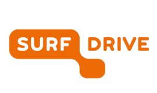

# Strategies to minimise risks to participants

## Research Ethics: Minimising Risks

Conducting ethical research means avoiding potential harm to participants from the moment you start designing your research project to the time the research is actually carried out. It's important to anticipate any damage that could occur from collecting, sharing, and storing personal data. In this section, we'll focus on strategies to minimise such risks.   

Here are three examples of risks related to personal data. Turn the cards to see potential mitigations for each:

```{h5p} https://tudelft.h5p.com/content/1292712792084421107/embed
```

## General Risk Minimisation Strategies

Here, we look at three common risk mitigation strategies.

### Risk Reduction Strategy #1: Obtain Consent from Participants
(informed-consent-section)=
#### Direct Consent through Informed Consent

An informed consent form (ICF) is standard practice used to mitigate risks for interviews, surveys, focus groups, ethnographic studies, observations, experiments with human participants, etc. An ICF is an agreement between the researcher (you) and the research participant (people from whom you plan to collect data).  

The general structure of an ICF is as follows:  

- **Intro**: explains who you are & research partners in the study.
- **The Topic**: explains what are you studying & what you  want to find out.
- **The Protocol**: explains what are you asking people to do and potential risks involved.
- **The Data**: to be collected.
- **Participants’ Rights**: explains that participants can exit the study at any time with no negative consequences.
- **Researcher's Contact Information**: gives participants a way to contact you if they have concerns or complaints.
- **The last line** asks for the participant's signature (can include the date).

Visit [this](https://www.tudelft.nl/over-tu-delft/strategie/integriteitsbeleid/human-research-ethics/informed-consent-templates-and-guide) link to see the Human Research Ethics Committee's templates and guidance.

Click here to see an example of an ICF **[NEED EXAMPLE FROM JANINE]**

You'll need to adapt these templates and examples to craft an ICF that fits your specific project.

```{note}
An ICF is only effective if it clearly informs your participants: **people need to understand exactly what they're signing up for** and how you will minimise the potential risks. Therefore it should clearly explain the purpose of the study, how the data will be used and stored, who will have access to it, and what rights participants have (e.g., to withdraw at any time). **A well-prepared ICF builds trust, ensures ethical compliance, and protects both you and the participants.**
```

#### Implied Consent via an Opening Statement

For anonymous surveys, an opening statement should be used instead of a signed informed consent letter. If your survey will not collect directly identifiable details like participants’ names/contact information, an opening statement is recommended because it actually minimises the collection of directly identifiable personal data. An opening statement functions like a cover page to the survey. Just like an informed consent form, an opening statement should clearly summarize the purpose of the study, how the data will be used and processed, how the data will be stored and protected, and for how long.

The main difference is that participants do not give their name or signature. Instead, they are asked to imply their consent by clicking a button to proceed to the start of the survey.

#### What if informed consent cannot be obtained?

If you cannot obtain informed consent, for instance, if you plan to re-use data from humans from social media, your supervisor will need to reach out to the TU Delft Privacy Team regarding the lawful basis and required measures.

### Risk Reduction Strategy #2: Anonymising & Pseudonymising Personal Data

**Anonymisation** is the process of modifyng/erasing all personal data that may be traceable to a unique person in such a way that it is no longer possible to link it to a specific research participant. Anonymisation is permanent and irreversible. After a data set is anonymised it's no longer considered personal data because the information cannot be traced back to any single participant. Anonymisation makes it possible to store, process, and share without exposing people's personal data. 

- *Example 1*: In a large-scale survey on students’ learning experiences across universities, full anonymisation means removing all personal data that could be linked back to an individual. For example, deleting student ID numbers, email addresses, and names of supervisors mentioned in responses. 

- Good practice is not to collect such personal details in the first place if they are not essential to address research questions (note: it may be necessary to collect names for the purposes of informed consent). But if they have already been collected, researchers must ensure they are removed so the dataset can no longer be traced back to a specific person. 

- *Example 2*: A dataset contains interview transcripts with quotes like “As the only female professor in the Department of Chemical Engineering, I often feel….” This clearly identifies the participant. After anonymisation, the transcript is changed to “As a professor in my department, I often feel….” The reference to a gender and specific department is removed so the statement can no longer be traced back to one individual.

**Pseudonymisation** means that a researcher replaces certain personal data with anonymous identifiers such as number or letter combinations in a way that the personal data can't point to a specific subject without additional information. As part of pseudonymisation the researcher also aggregates the data or replaces specific details with more general categories. 

- *Example*: A researcher recorded participants’ last names. To pseudonymise the data, she replaces the last names with number codes and creates a key showing the code for each name. Pseudonymised data can be share with restricted access, with participants' consent. She must then store the key in a secure location and control access to it since the key allows for reidentification of participants. 

This example illustrates that pseudonymisation is **reversible** (with the key). This is why **pseudonymised data is still considered personal data.**

- Let's revisit the example of the large-scale survey on students’ learning experiences that was mentioned in the section above. In this example, you can adjust identifiers without impacting the research question. For instance, detailed programme codes can be **aggregated** by grouping into faculty/discipline, and individual campus or city names can be **aggregated** into broader regions. Student IDs can then be pseudonymised by replacing the IDs with random codes. Ensure the linkage file (code key) is stored separately in a secure location, with access restricted to the minimum necessary project collaborators.

Anonymisation and pseudonymisation are time-intensive processes. We recommend that you design your study to collect only the personal data  that you absolutely need to answer your research question(s). Right now, in the planning phase of your research, you must establish whether you will anonymise or pseudonymise participants’ personal data. You'll need to describe how/what you will anonymise or pseudonymise on the Informed Consent form as well as in your ethics application.

### Risk Reduction Strategy #3: Secure Storage

Secure data storage practices are a key risk mitigation strategy. Secure storage protects you against data loss and protects personal data from security breaches or leaks. You must choose a storage solution appropriate to the size and the sensitivity of the data, and preferably a platform that stores data within the EU. If applicable, you might also consider which storage options allow you to share the data securely with collaborators. File sharing only applies if you are working with data that can legally and ethically be shared.  As we learned, some sensitive personal data and proprietary data should not be shared freely. 

The following gives an overview of recommended storage platforms for master’s students at TU Delft:   

#### Recommended Storage Platforms

```{dropdown} Project Folder (U:) Drive

**Key details**
* If you are working with special categories of personal data or data from vulnerable subjects, it is strongly recommended to use Project Data (U:) Drive, a network drive provided by TU Delft, for secure data storage.
* A supervisor must submit a request in TopDesk to create or delete a folder on an MSc student's behalf by submitting a request to ICT services.

**Benefits**
* Data saved in a Project Data (U:) Drive is automatically backed up by the TU Delft ICT department. So, when using the Project Data (U:) drive you can rest assured that data of your participants is securely stored, with no risk of the data getting lost.
* A Project Drive (U:) Drive is accessible off campus by using the eduVPN server. (New to eduVPN? Find instructions here.)
* A Project Data (U:) Drive can be accessed by other project members. Your supervisor will need to indicate in the request form who will have access to it by providing their full name and netIDs.

**Potential Exceptions**
* For proprietary data you should check the agreement with the company if saving data on the Project Data (U:) drive is allowed.
```

```{dropdown} Surf Drive 

**Key details**
* With SURF's community cloud it's possible to store, synchronise and share your files easily and securely.
* Your supervisor must request access to a SURF Drive folder on your behalf.

**Benefits**
* Access files anywhere with internet.
* 500 TB of storage space.
* Secure place to store personal data (for exceptions see below).
* Possible sharing with external collaborators, even if they are not SURFdrive users.

**Potential exceptions:**
* SURFdrive is not suitable for highly sensitive personal data. When in doubt, check with your faculty data steward if the data of your project can be stored in SURFdrive.
* For proprietary data you should check the agreement with the company if saving data on the SURFdrive is allowed.
* SURFdrive is recommended to be used as a temporary storage for research data, not as a primary storage location. This is because it is linked to your netID, and once you leave TU Delft the data will be lost.
* You need to ensure that the data stored in SURFdrive will be transferred to your supervisor when the project ends.
```

```{dropdown} One Drive for Business

**Key details**
* Master's students at TU Delft are assigned a OneDrive account for storing personal documents
* TU Delft IT department do not advise using One Drive for Business to store research data.
* Highly confidential or sensitive data should not be stored in One Drive without an encryption.
* OneDrive folders containing your research data should be shared with your supervisor(s).

**Benefits**
* OneDrive allows for file sharing
* Files stored on the OneDrive are automatically backed up.
* You can access files saved to OneDrive from the browser anywhere with an internet connection.
* You can set up a desktop version of OneDrive to back up your personal device.

**Potential drawbacks**
* OneDrive is not a secure storage option for sensitive personal data, high-risk special category data, or data from vulnerable subjects. When in doubt, check with your faculty data steward regarding secure storage locations.
* Consider using One Drive for Business only as a temporary (not primary) storage location. Once you leave TU Delft the data will be permanently deleted.
* For proprietary data you should check the agreement with the company if using OneDrive is allowed.
* The amount of storage space on OneDrive (300 GB) might not be enough to store some types of data (ex: collections of high-speed video files).
```

#### NOT recommended for storage

- Commercial third party cloud storage such as Dropbox and Google Drive: avoid storing data on your personal (non-TU Delft) accounts, particularly personal research data. Cloud applications such as Google and Dropbox store data outside the EU, and are thus not approved by TU Delft.   

- Portable drives such as hard drives and thumb drives: it’s too easy for these to get damaged, lost or fall into the wrong hands.   

- Floating on the desktop of your personal computer: this puts any personal data at risk (and all your work could get lost if stolen or broken).  

- Remember that a personal data breach or leak can lead to serious consequences. 

#### General storage best practices

- Whenever possible, directly identifiable details should be stored separately from indirectly identifiable information in order to decrease the potential for reidentification of participants.  
    - For example: informed consent forms with participants’ names and signatures should be stored in a secure folder separate from the other raw data. The same rule applies to the keys for pseudonymised data. 

- Institutional TU Delft storage solutions should be used.  

- Your supervisor should have access to the data.  

- It's important to discuss the end-of-life of the data with your supervisor: How long should the data be stored? Where? Who will have access to it? 

**Practice:** Take this optional quiz to check your understanding of risk mitigation strategies. 

**[H5P LINK]**